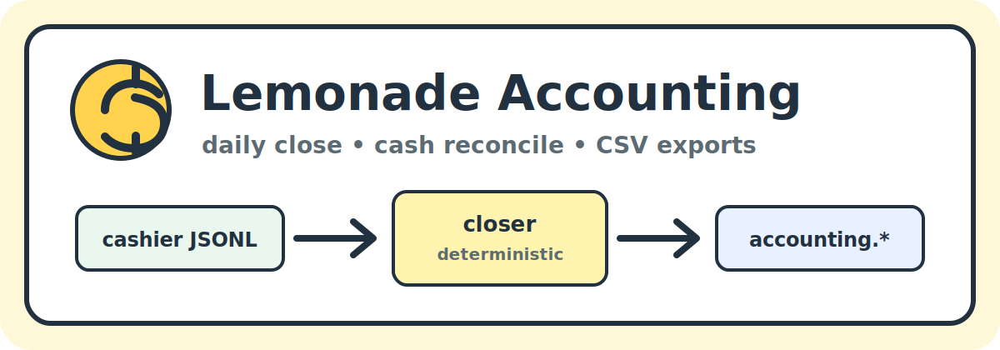

# Lemonade Accounting

[](https://github.com/bong-water-water-bong/lemonade-accounting/actions/workflows/ci.yml)
[](https://github.com/bong-water-water-bong/lemonade-accounting/actions/workflows/docs.yml)
[](pyproject.toml)
[](https://github.com/bong-water-water-bong/lemonade-store)
[](https://github.com/bong-water-water-bong/lemonade-cashier)
[](LICENSE)

<p align="center">
  
</p>

> Daily close, cash reconciliation, and CSV exports for Lemonade Store.

**Lemonade Accounting** is the `accounting` department of
[Lemonade Store](https://github.com/bong-water-water-bong/lemonade-store).
It reads
[Lemonade Cashier](https://github.com/bong-water-water-bong/lemonade-cashier)'s
native event log and emits `accounting.*` envelope events in the shared
`store.event.v1` shape.

v0.1 ships one agent — the **`closer`** — and one export — the per-day
transactions CSV.

## What it does

```text
cashier events.jsonl   →   closer   →   accounting.daily_close (envelope)
                              ↓
                              →   transactions.csv (for outside accountant)
```

The closer is:

- **Read-only** with respect to cashier events. It never mutates or
  rewrites a closed cashier transaction.
- **Deterministic.** Re-running on the same inputs produces the same
  `accounting.daily_close` event, including the same `event_id`. Safe
  to run from cron and ad-hoc.
- **Time-bounded.** A wall-clock budget (default 5 s) on the cashier
  log read; the closer never blocks a till.
- **Offline.** No cloud dependency. The outside accountant gets a CSV.

## What it does NOT do

- No card / wallet / processor payment paths. Ever. (This is a
  permanent boundary inherited from the store-suite contracts.)
- No tax filing decisions. The closer summarizes; humans file.
- No mutation of cashier events.
- No automatic accountant export to a cloud service.

## Install

```sh
make install
make test
```

Python 3.11+. The runtime depends on
`lemonade-store @ git+https://github.com/bong-water-water-bong/lemonade-store@v0.1.0`
for the shared envelope; everything else is stdlib.

## CLI

```sh
lemonade-accounting close \
    --events /home/bcloud/lemonade-data/tie-dye-farms/cashier/events.jsonl \
    --date 2026-05-19 \
    --store-id tie-dye-farms \
    --csv /home/bcloud/lemonade-data/tie-dye-farms/accounting/exports/2026-05-19.csv
```

`close` prints the daily-close envelope event to stdout as one line
of JSON. Pipe it into a store-wide JSONL log:

```sh
lemonade-accounting close ... >> ~/lemonade-data/tie-dye-farms/store_events.jsonl
```

## Library

```python
from datetime import date
from lemonade_accounting import daily_close, read_cashier_events

events = read_cashier_events("path/to/cashier/events.jsonl")
close = daily_close(events, date_utc=date(2026, 5, 19), store_id="tie-dye-farms")
print(close.summary.sales_total)       # Decimal("...")
print(close.event["event_id"])         # accounting-daily-close-tie-dye-farms-2026-05-19-<16-hex>
# `<16-hex>` is a SHA-256 prefix over the canonical JSON form of
# {store_id, date, payload}: identical canonical bytes → identical id,
# so re-runs of the closer are byte-for-byte idempotent.
```

## Status

- v0.1 (this repo's `main`): closer + daily_close + CSV export.
- Next: cash drawer reconciliation (`accounting.cash_reconciled`),
  barter ledger (`accounting.barter_recorded`), supplier expense
  intake. See `docs/BUILD_ORDER.md`.

## License

MIT. See [`LICENSE`](LICENSE).
